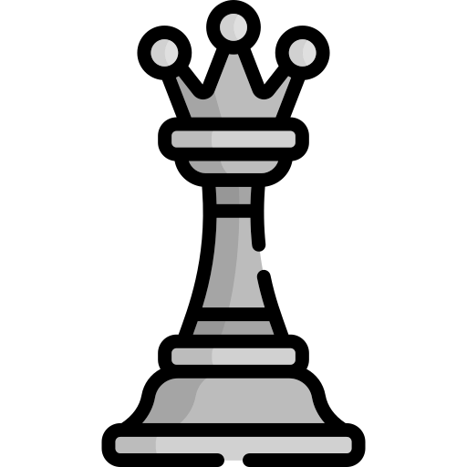

# Tanish Shinde

 
  

<!-- BEGIN CHESS BOARD -->
|   | A | B | C | D | E | F | G | H |   |
|---|:-:|:-:|:-:|:-:|:-:|:-:|:-:|:-:|:-:|
| **8** |  |  |  |  |  |  |  |  | **8** |
| **7** |  |  |  |  |  |  |  |  | **7** |
| **6** |  |  |  |  |  |  |  |  | **6** |
| **5** |  |  |  |  |  |  |  |  | **5** |
| **4** |  |  |  |  |  |  |  |  | **4** |
| **3** |  |  |  |  |  |  |  |  | **3** |
| **2** |  |  |  |  |  |  |  |  | **2** |
| **1** |  |  |  |  |  |  |  |  | **1** |
|   | **A** | **B** | **C** | **D** | **E** | **F** | **G** | **H** |   |
<!-- END CHESS BOARD -->

## Chess Game

**It's your turn to move. Just move a <!-- BEGIN TURN -->black<!-- END TURN --> piece to play.  You can choose any one from the following table.**

<!-- BEGIN MOVES LIST -->
|  FROM  | TO (Just click a link!) |
| :----: | :---------------------- |
| **A5** | [A4](https://github.com/yourtanish/yourtanish/issues/new?body=Please+do+not+change+the+title.+Just+click+%22Submit+new+issue%22.+You+don%27t+need+to+do+anything+else+%3AD&title=Chess%3A+Move+A5+to+A4) |
| **A8** | [A6](https://github.com/yourtanish/yourtanish/issues/new?body=Please+do+not+change+the+title.+Just+click+%22Submit+new+issue%22.+You+don%27t+need+to+do+anything+else+%3AD&title=Chess%3A+Move+A8+to+A6), [A7](https://github.com/yourtanish/yourtanish/issues/new?body=Please+do+not+change+the+title.+Just+click+%22Submit+new+issue%22.+You+don%27t+need+to+do+anything+else+%3AD&title=Chess%3A+Move+A8+to+A7) |
| **B7** | [B5](https://github.com/yourtanish/yourtanish/issues/new?body=Please+do+not+change+the+title.+Just+click+%22Submit+new+issue%22.+You+don%27t+need+to+do+anything+else+%3AD&title=Chess%3A+Move+B7+to+B5), [B6](https://github.com/yourtanish/yourtanish/issues/new?body=Please+do+not+change+the+title.+Just+click+%22Submit+new+issue%22.+You+don%27t+need+to+do+anything+else+%3AD&title=Chess%3A+Move+B7+to+B6) |
| **B8** | [A6](https://github.com/yourtanish/yourtanish/issues/new?body=Please+do+not+change+the+title.+Just+click+%22Submit+new+issue%22.+You+don%27t+need+to+do+anything+else+%3AD&title=Chess%3A+Move+B8+to+A6), [C6](https://github.com/yourtanish/yourtanish/issues/new?body=Please+do+not+change+the+title.+Just+click+%22Submit+new+issue%22.+You+don%27t+need+to+do+anything+else+%3AD&title=Chess%3A+Move+B8+to+C6) |
| **C7** | [C5](https://github.com/yourtanish/yourtanish/issues/new?body=Please+do+not+change+the+title.+Just+click+%22Submit+new+issue%22.+You+don%27t+need+to+do+anything+else+%3AD&title=Chess%3A+Move+C7+to+C5), [C6](https://github.com/yourtanish/yourtanish/issues/new?body=Please+do+not+change+the+title.+Just+click+%22Submit+new+issue%22.+You+don%27t+need+to+do+anything+else+%3AD&title=Chess%3A+Move+C7+to+C6) |
| **D7** | [D5](https://github.com/yourtanish/yourtanish/issues/new?body=Please+do+not+change+the+title.+Just+click+%22Submit+new+issue%22.+You+don%27t+need+to+do+anything+else+%3AD&title=Chess%3A+Move+D7+to+D5), [D6](https://github.com/yourtanish/yourtanish/issues/new?body=Please+do+not+change+the+title.+Just+click+%22Submit+new+issue%22.+You+don%27t+need+to+do+anything+else+%3AD&title=Chess%3A+Move+D7+to+D6) |
| **E7** | [E5](https://github.com/yourtanish/yourtanish/issues/new?body=Please+do+not+change+the+title.+Just+click+%22Submit+new+issue%22.+You+don%27t+need+to+do+anything+else+%3AD&title=Chess%3A+Move+E7+to+E5), [E6](https://github.com/yourtanish/yourtanish/issues/new?body=Please+do+not+change+the+title.+Just+click+%22Submit+new+issue%22.+You+don%27t+need+to+do+anything+else+%3AD&title=Chess%3A+Move+E7+to+E6) |
| **F7** | [F5](https://github.com/yourtanish/yourtanish/issues/new?body=Please+do+not+change+the+title.+Just+click+%22Submit+new+issue%22.+You+don%27t+need+to+do+anything+else+%3AD&title=Chess%3A+Move+F7+to+F5), [F6](https://github.com/yourtanish/yourtanish/issues/new?body=Please+do+not+change+the+title.+Just+click+%22Submit+new+issue%22.+You+don%27t+need+to+do+anything+else+%3AD&title=Chess%3A+Move+F7+to+F6) |
| **G7** | [G5](https://github.com/yourtanish/yourtanish/issues/new?body=Please+do+not+change+the+title.+Just+click+%22Submit+new+issue%22.+You+don%27t+need+to+do+anything+else+%3AD&title=Chess%3A+Move+G7+to+G5), [G6](https://github.com/yourtanish/yourtanish/issues/new?body=Please+do+not+change+the+title.+Just+click+%22Submit+new+issue%22.+You+don%27t+need+to+do+anything+else+%3AD&title=Chess%3A+Move+G7+to+G6) |
| **G8** | [F6](https://github.com/yourtanish/yourtanish/issues/new?body=Please+do+not+change+the+title.+Just+click+%22Submit+new+issue%22.+You+don%27t+need+to+do+anything+else+%3AD&title=Chess%3A+Move+G8+to+F6), [H6](https://github.com/yourtanish/yourtanish/issues/new?body=Please+do+not+change+the+title.+Just+click+%22Submit+new+issue%22.+You+don%27t+need+to+do+anything+else+%3AD&title=Chess%3A+Move+G8+to+H6) |
| **H7** | [H5](https://github.com/yourtanish/yourtanish/issues/new?body=Please+do+not+change+the+title.+Just+click+%22Submit+new+issue%22.+You+don%27t+need+to+do+anything+else+%3AD&title=Chess%3A+Move+H7+to+H5), [H6](https://github.com/yourtanish/yourtanish/issues/new?body=Please+do+not+change+the+title.+Just+click+%22Submit+new+issue%22.+You+don%27t+need+to+do+anything+else+%3AD&title=Chess%3A+Move+H7+to+H6) |
<!-- END MOVES LIST -->

#### How it works

When you click on a link and submit a new issue with the desired move, a GitHub action is triggered, which in turn runs a small python script that performs the specified movement, updates this README file and commits the changes.

  
Last 5 moves in this game

<!-- BEGIN LAST MOVES -->

| Move | Author |
| :--: | :----- |
| `E2` to `E4` | [ @LouisRenardMedia](https://github.com/LouisRenardMedia) |
| `A7` to `A5` | [ @yourtanish](https://github.com/yourtanish) |
| `D2` to `D4` | [ @LouisRenardMedia](https://github.com/LouisRenardMedia) |
| `Start game` | [ @yourtanish](https://github.com/yourtanish) |

<!-- END LAST MOVES -->

  
Top 10 most moves across all games

<!-- BEGIN TOP MOVES -->

| Total moves |  User  |
| :---------: | :----- |
| 2 | [@yourtanish](https://github.com/yourtanish) |
| 2 | [@LouisRenardMedia](https://github.com/LouisRenardMedia) |

<!-- END TOP MOVES -->

